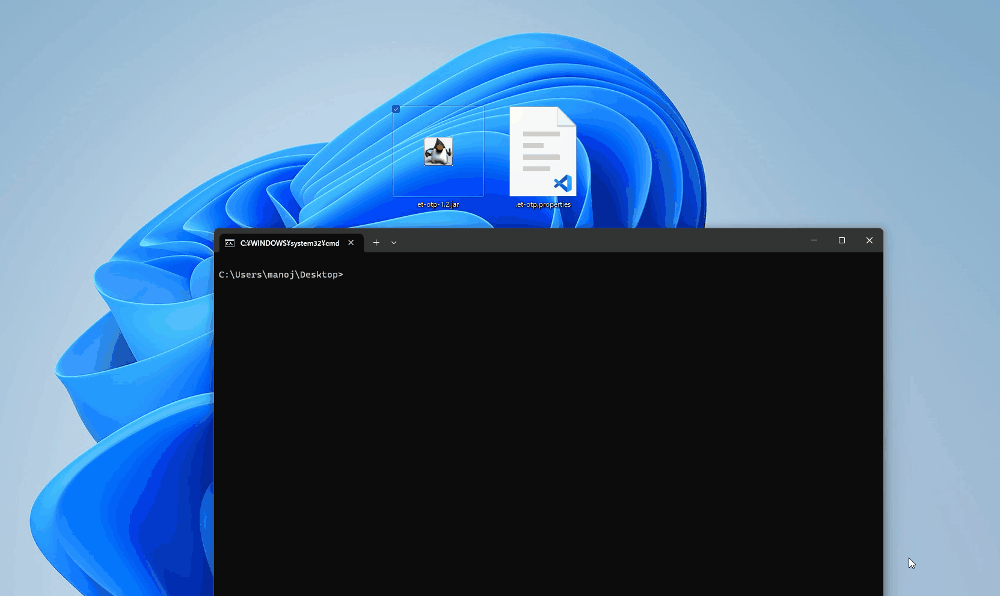

# goetotp

`goetotp` is [et-otp](http://ecki.github.io/et-otp/) alternative command line tool that generate TOTP code.

Currently, `goetotp` can only generate 6-digit totp codes.

## Demo



## Setup

goetotp is required .et-otp.properties.

See the following et-otp [GitHub Wiki](https://github.com/ecki/et-otp/wiki) pages for a more detailed description:

* [Setting up Google 2-step verification](https://github.com/ecki/et-otp/wiki/Setting%20up%20Google%202-step%20verification)
* [Setting up Amazon MFA](https://github.com/ecki/et-otp/wiki/Setting%20up%20Amazon%20MFA)
* [Setting up Microsoft 2-Step verification](https://github.com/ecki/et-otp/wiki/Setting%20up%20Microsoft%202-Step%20verification)

## Usage

* Set up with `et-otp.jar` and create `.et-top.properties` file in your directory

```sh
$  goetotp --unlockpassword <YOUR UNLOCK PASSWORD>
```

Unlock password is the same value used in et-otp.jar.

### Example

```sh
$  goetotp --unlockpassword MyPassword9999
123456
```

You can use password via std input or environment variable.

```sh
# Std input
$ goetotp
Enter unlock password: 
123456

# Environment variable
$ export ETOTP_PASSWORD=xxxxxxxxxxxxxxxx
$ goetotp
123456
```

### Installation

From source code:

```sh
go install github.com/ma91n/goetotp/cmd/goetotp@latest
```
